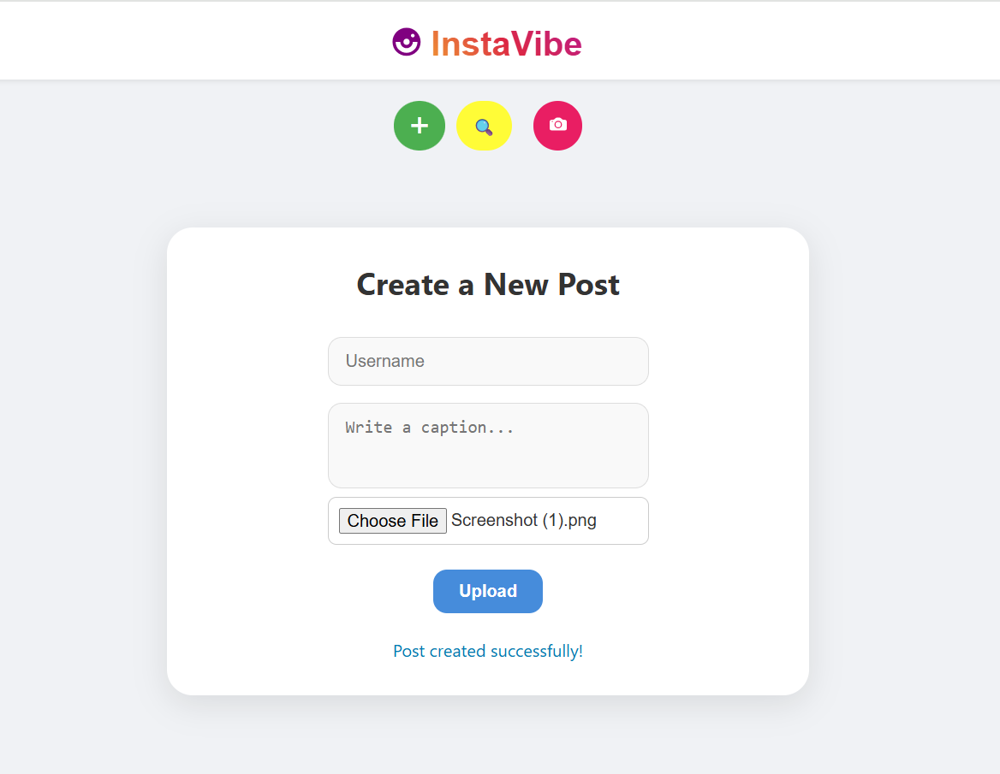
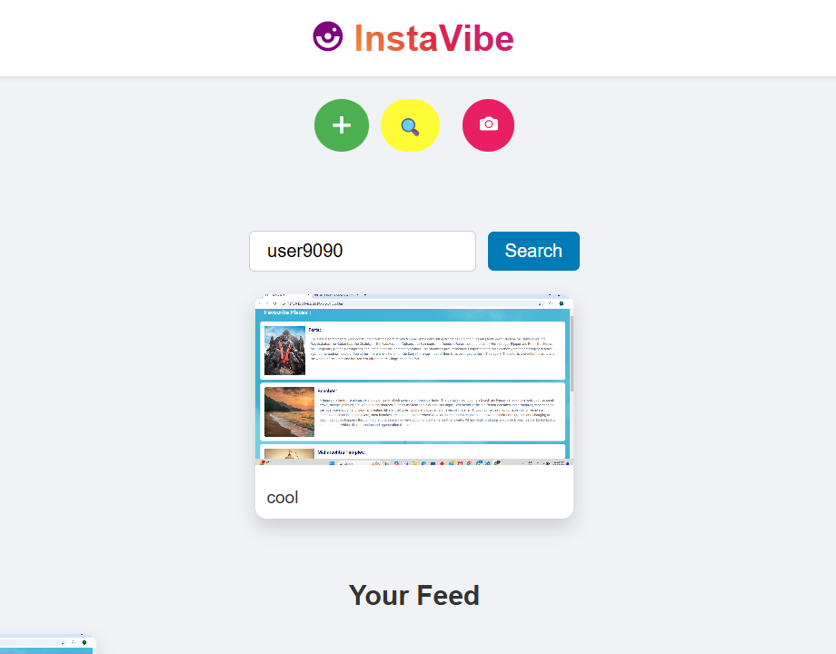
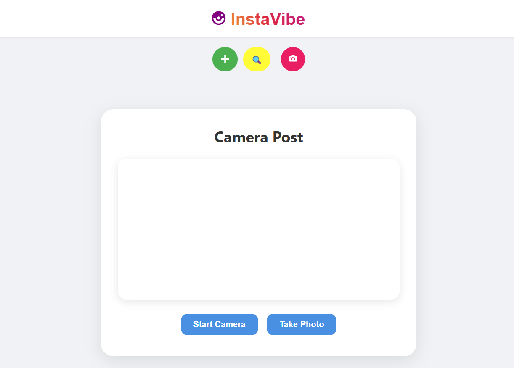

# 📸 InstaVibe

InstaVibe is a full-stack photo-sharing web app inspired by Instagram. It allows users to upload photos with captions, view image feeds by username, and even take instant photos using their device's camera. Built using the MERN stack, Cloudinary, and deployed via Firebase and Render.

---

## 🌐 Live Demo

- **Frontend (Firebase):** [https://instavibe-f1447.web.app](https://instavibe-f1447.web.app)
- **Backend (Render):** [https://instavibe-2-xvd3.onrender.com](https://instavibe-2-xvd3.onrender.com)

---

## 🧠 Features

- 📤 Upload a post with **username**, **caption**, and **image**
- 🔍 Search and display posts by **username**
- 📷 Take a photo directly from your **camera** and upload it
- ☁️ Image hosting via **Cloudinary**
- 📁 MongoDB backend to store user posts

---

## 🧪 Screenshots

### 🔹 Create a New Post
Upload an image with a username and caption.



---

### 🔹 Search Posts by Username
Search for posts by a specific username and view their uploaded feed.



---

### 🔹 Take a Photo with Camera
Access your device camera to click and upload a photo instantly.



---

## 🛠️ Tech Stack

| Technology      | Purpose                         |
|-----------------|---------------------------------|
| React           | Frontend user interface         |
| Node.js         | Backend runtime environment     |
| Express.js      | API framework                   |
| MongoDB         | NoSQL database                  |
| Cloudinary      | Image upload & hosting          |
| Multer          | Handle form file uploads        |
| Firebase        | Hosting frontend                |
| Render          | Hosting backend API             |

---

## 📂 Folder Structure
/client → React frontend (deployed on Firebase)
/server → Node.js backend (deployed on Render)
└─ server.js
└─ .env
└─ firebase.json


---

## 🔐 Environment Variables (Backend `.env`)

```env
MONGO_URL=your_mongodb_url
CLOUD_NAME=your_cloudinary_name
CLOUD_KEY=your_cloudinary_api_key
CLOUD_SECRET=your_cloudinary_api_secret
PORT=3000

📦 API Endpoints
POST /upload
Upload a photo with form-data:

1.file (image)
2.username
3.caption

GET /files
Retrieve all uploaded posts. Optional filter by username:
GET /files?username=yourname

DELETE /delete/:id
Deletes a post from both database and Cloudinary.

🚀 Local Development
🔹 Backend
cd server
npm install
npm run start

🔹 Frontend
cd client
npm install
npm start

📦 Deployment
Frontend: Deployed on Firebase using:
npm run build
firebase deploy
Backend: Deployed on Render with environment variables securely set via the dashboard.


💡 Future Enhancements
🛡️ JWT-based authentication

❤️ Like and 💬 comment system

🧑‍🤝‍🧑 Follow/Unfollow users

🌐 Share posts to social media

🧠 AI-powered caption suggestions (future AI integration)

🙋‍♂️ Author
👨‍💻 Omkar Mahadik

📄 License
This project is licensed under the MIT License.

